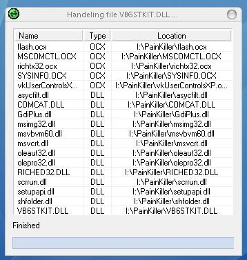



## RegThem

### Description

RegThem is a very handy program to register any *.ocx and *.dll files with out wrighting any *.bat or *.cmd files. You do not have to do anything to register any activex. u can use it at your instllation program too. it dosen't act like a blind one, it works autometically. Just compile the exe, put in the folder of your activx, and then just run it, RegThem'll collect and register all of them autometically, without showing you the REGSERV32 consol. Use it as u want. don't forget to vote for me.
 
### More Info
 

             |
---                |---
**Submitted On**   |2008-08-29 22:36:10
**By**             |[Ratul Ahmed](https://github.com/Planet-Source-Code/PSCIndex/blob/master/ByAuthor/ratul-ahmed.md)
**Level**          |Beginner
**User Rating**    |5.0 (15 globes from 3 users)
**Compatibility**  |VB 6\.0
**Category**       |[OLE/ COM/ DCOM/ Active\-X](https://github.com/Planet-Source-Code/PSCIndex/blob/master/ByCategory/ole-com-dcom-active-x__1-29.md)
**World**          |[Visual Basic](https://github.com/Planet-Source-Code/PSCIndex/blob/master/ByWorld/visual-basic.md)
**Archive File**   |[RegThem21326010312008\.zip](https://github.com/Planet-Source-Code/ratul-ahmed-regthem__1-71323/archive/master.zip)

